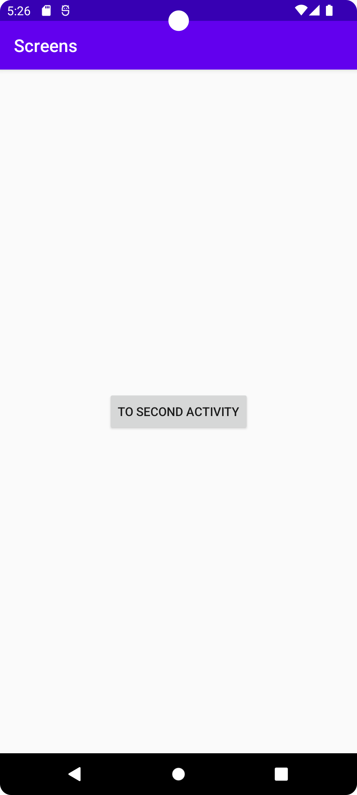
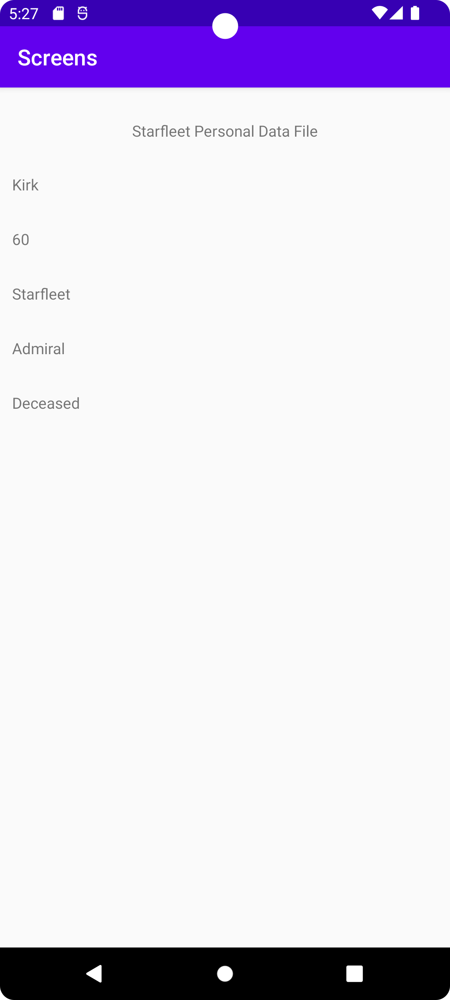

# Rapport

Changed JDK version to 11 and did commit and push.

Created a new activity and named it "SecondActivity". Some code was generated by the IDE and as the compiler couldn't resolve 
the EdgeToEdge references I opted to comment out those references as I really didn't need them.
Added a Button to MainActivity.java with an onclick listener.

These changes were pushed to the Github repository.

Added an Intent in Button onClick and set it to open SecondActivity.java.
Added both String and int data to the intent bundle using extras.

These changes were pushed to the Github repository.

Moved the Button name to Strings.xml and replaced it with a reference to that value.

These changes were pushed to the Github repository.

This resulted in my starting view as can be seen in image 1.

**Image 1**



Added TextView and RecyclerView to activity_second.xml. Gave the TextView a value to display.

This change was pushed to the Github repository.

Moved the display value of the TextView to Strings.xml and replaced it with a reference to that value.

This change was pushed to the Github repository.

Added a Recycleview Adapter named MyRecycleViewAdapter.java and proceeded to add a storage class for the Bundle data 
named RecyclerViewItems.java (see Code Listing 1).
Added a layout file for the recyclerview text rows named text_row_item.xml.
Added a values file for text_row_item.xml named dimens.xml.

These changes were pushed to the Github repository.

** Code Listing 1 **
```
public class RecyclerViewItems implements Serializable {
    private String[] dataSet;

    public RecyclerViewItems (String name, int age, String career, String rank, String status) {
        this.dataSet = new String[] {name, String.valueOf(age), career, rank, status};
    }
    // Getters for all member variables
    public String[] getDataset() {
        return dataSet;
    }
}
```

Changed px to dp in dimens.xml.

This change was pushed to the Github repository.

Experienced errors when trying to build my project. Upon suggestion I added some parameters to lines 22-26 in gradle.properties.
Changed the Gradle wrapper to version 6.7.1 to fix a compatibility issue.
Fixed a small typo on line 19 in MyRecycleViewAdapter.java.

These changes were pushed to the Github repository.

Ran my project in the emulator with success. The button in MainActivity opens SecondActivity which displays the data from the bundle
which can be seen in image 2.

**Image 2**


